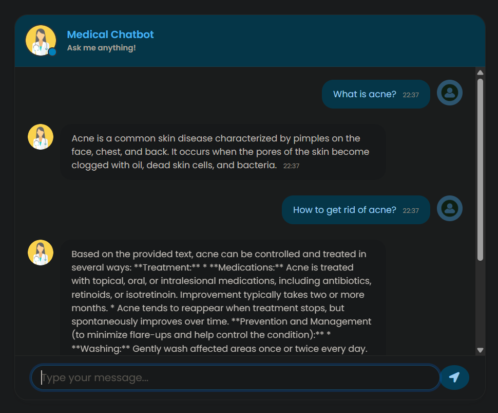
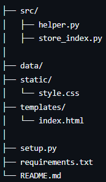

# Medical-Chatbot

A Retrieval-Augmented Generation (RAG) based medical question-answering system built with Flask, LangChain, Pinecone, and HuggingFace embeddings.




## Features

- PDF loading using `PyPDFLoader`
- Text chunking with `RecursiveCharacterTextSplitter`
- Embeddings using `all-MiniLM-L6-v2`
- Vector search using Pinecone Serverless
- Flask backend with `/get` query endpoint
- Chat UI built with Bootstrap + jQuery (AJAX)
- Automatic vector index creation


## Tech Stack

**Frontend**
- HTML, CSS, Bootstrap 4
- jQuery (for AJAX)

**Backend**
- Python, Flask
- LangChain
- HuggingFace Embeddings
- Pinecone Vector Store

**LLM**
- Google Gemini

## Structure



## Setup

### 1. Clone the repository
```bash
git clone https://github.com/YOUR_USERNAME/medical-chatbot.git
cd medical-chatbot
```

## Project Structure
### 2. Create a virtual environment
```bash
python -m venv venv
```
Activate it:

```
# Windows
venv\Scripts\activate

# Linux/macOS
source venv/bin/activate
```

### 3. Install dependencies
```
pip install -r requirements.txt
```

### 4. Create a .env file
```
PINECONE_API_KEY=your_pinecone_key
GOOGLE_API_KEY=your_gemini_key
```

### 5. Build the index
```
python src/store_index.py
```

### 6. Run the Flask app
```
python app.py
```

Visit:
http://127.0.0.1:5000/


## RAG Pipeline Overview

1. PDFs → loaded using `DirectoryLoader`
2. Text → chunked into 500-char blocks
3. Chunks → embedded using MiniLM-L6-v2
4. Embeddings → stored in Pinecone
5. User query → embedded + vector search
6. Retrieved chunks → passed to LLM for grounded response


## Contributing

Pull requests are welcome.


## License

MIT License.
